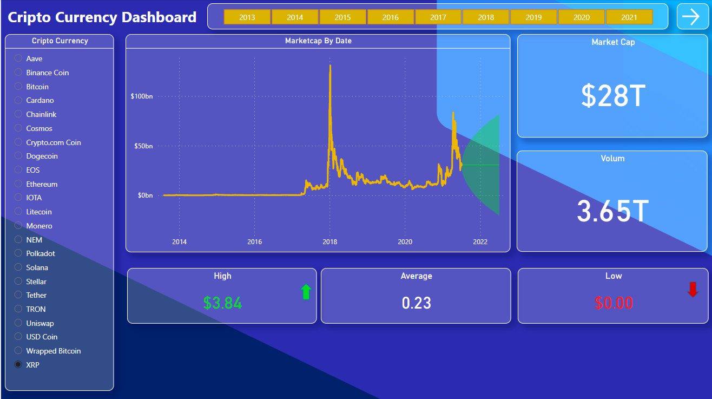
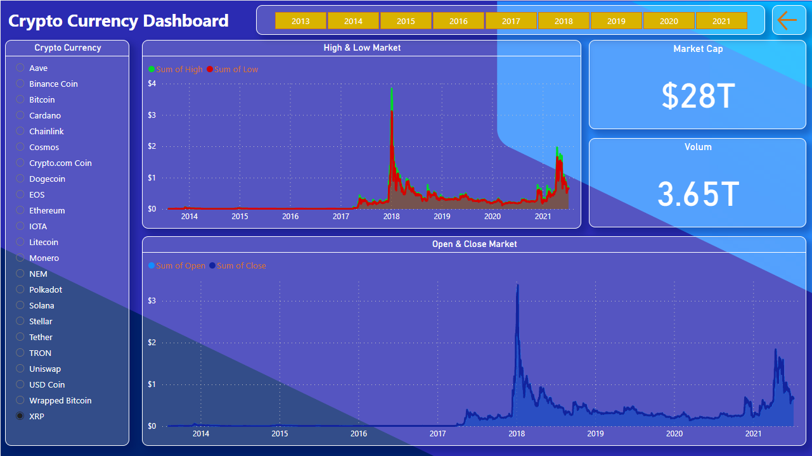

# Power BI Project  on Crypto Currency Dashboard

### This Project is based on an  Crypto Currency data Analytics. 

Power BI project on cryptocurrency data. Power BI is a powerful data visualization tool that can be used to analyze and visualize data from various sources, including cryptocurrencies. 

Here's a step-by-step guide to creating a Power BI project on cryptocurrency data:

## Page - 1 

## Page - 2
